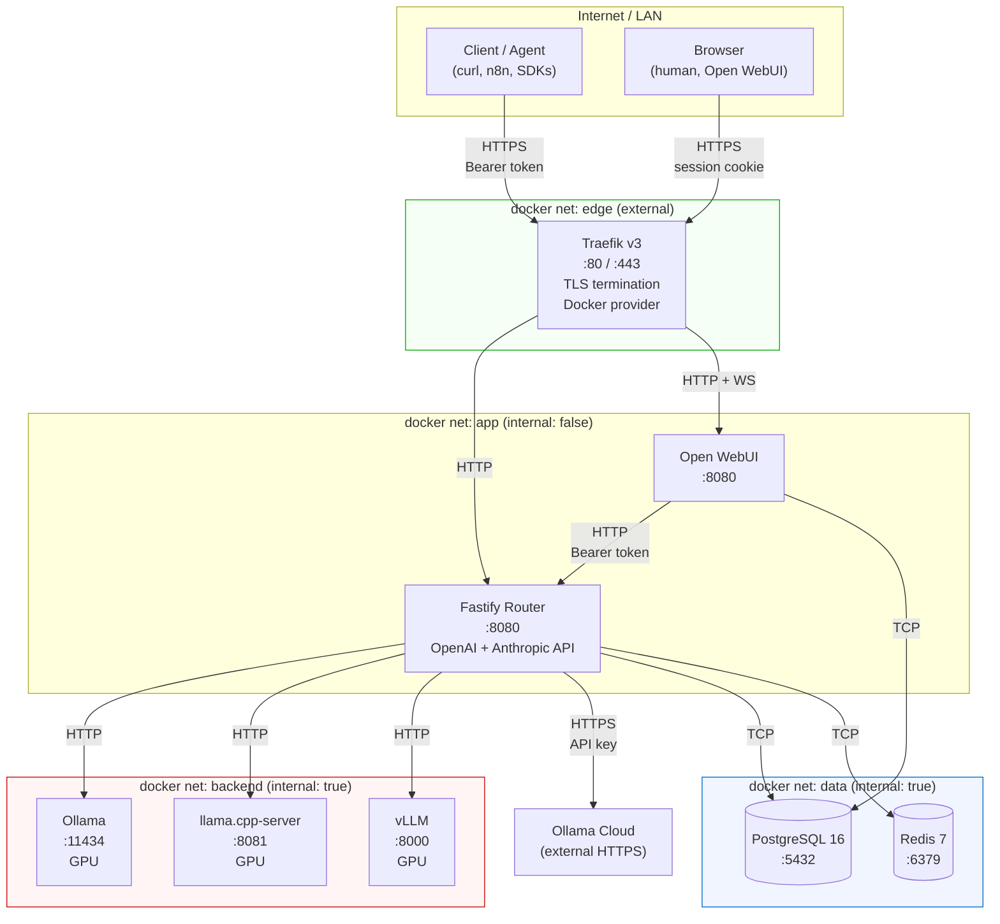

# Architecture Research

**Domain:** Self-hosted multi-runtime LLM gateway (single-host, single-user, NVIDIA GPU)
**Researched:** 2026-05-09
**Confidence:** HIGH (Docker / Traefik / Compose patterns), MEDIUM-HIGH (router topology — convention but not "the one true way")

---

## 1. System Overview — Topology Diagram

### Mermaid view



### ASCII fallback

```
                         Internet / LAN
                              │
                              ▼
                  ┌───────────────────────┐
                  │  Traefik (:80, :443)  │  edge net (external)
                  │  TLS, Docker provider │
                  └──────────┬────────────┘
                             │ HTTP (cleartext, internal)
              ┌──────────────┴────────────────┐
              ▼                                ▼
     ┌─────────────────┐              ┌─────────────────┐
     │ Fastify router  │◄─────────────│  Open WebUI     │   app net
     │ :8080           │   bearer     │  :8080 (+WS)    │
     │ /v1/chat/...    │              │                 │
     │ /v1/messages    │              │                 │
     └────┬─────┬──────┘              └────────┬────────┘
          │     │                              │
          │     └─────────► Ollama Cloud       │
          │                  (HTTPS)           │
          ▼                                    ▼
     ┌─────────────────────────────────────────────────┐
     │            backend net (internal: true)         │
     │  ┌──────────┐  ┌──────────────┐  ┌──────────┐  │
     │  │ Ollama   │  │ llama.cpp    │  │ vLLM     │  │
     │  │ :11434   │  │ -server:8081 │  │ :8000    │  │
     │  │ GPU      │  │ GPU          │  │ GPU      │  │
     │  └──────────┘  └──────────────┘  └──────────┘  │
     └─────────────────────────────────────────────────┘
          │ (router + webui only)
          ▼
     ┌─────────────────────────────────────────────────┐
     │             data net (internal: true)           │
     │   ┌─────────────────┐    ┌──────────────┐       │
     │   │ PostgreSQL 16   │    │ Redis 7      │       │
     │   │ :5432           │    │ :6379        │       │
     │   └─────────────────┘    └──────────────┘       │
     └─────────────────────────────────────────────────┘
```

### Component Responsibilities

| Component | Responsibility | Port (in container) | GPU? | Public? |
|-----------|----------------|---------------------|------|---------|
| **Traefik v3** | TLS termination, host-based routing, Docker label discovery, redirect HTTP→HTTPS | 80, 443, (8080 dashboard local-only) | No | Yes (only thing bound to host :80/:443) |
| **Fastify router** | OpenAI + Anthropic API surface, model resolution, backend dispatch, SSE re-streaming, auth, request logging, usage metering, cache | 8080 | No | Behind Traefik only |
| **Open WebUI** | Manual experimentation UI, chat history, RAG, model comparison | 8080 | No (image generation off) | Behind Traefik only |
| **Ollama** | Local inference, easy model catalog, GGUF backend | 11434 | Yes | No (backend net only) |
| **llama.cpp-server** | Fine-grained GGUF inference, custom flags, latest quants | 8081 (mapped from `--port`) | Yes | No |
| **vLLM** | High-throughput HF model serving (safetensors, AWQ, GPTQ, FP8) | 8000 | Yes | No |
| **PostgreSQL 16** | Request log, token usage, per-model stats, Open WebUI's own DB (separate database) | 5432 | No | No (data net only) |
| **Redis 7** | Response cache (optional), rate-limit counters, hot router config cache | 6379 | No | No (data net only) |
| **Ollama Cloud** | Fallback for models that don't fit in 16 GB VRAM | 443 (out only) | N/A | External (router calls out) |

---

## 2. Network Design

### Recommended: four Docker networks, not one

The single-network approach works but is sloppy. With four networks the firewall is the topology — you don't have to remember which token-auth check might be missing.

```yaml
networks:
  edge:
    # Traefik <-> public
    # Traefik <-> app services (router, webui)
  app:
    internal: false   # router needs egress to Ollama Cloud
    # router <-> webui (so webui can call router /v1/...)
  backend:
    internal: true    # backends never need outbound internet
    # router <-> ollama, llama.cpp, vllm
    # webui  <-> ollama, llama.cpp, vllm   (only if you decide to wire it that way; recommended: NO, webui talks only to router)
  data:
    internal: true    # postgres, redis never need outbound internet
    # router <-> postgres, redis
    # webui  <-> postgres
```

**Membership matrix:**

| Service | edge | app | backend | data |
|---------|:----:|:---:|:-------:|:----:|
| traefik | ✓    | ✓   |         |      |
| router  |      | ✓   | ✓       | ✓    |
| webui   |      | ✓   |         | ✓    |
| ollama  |      |     | ✓       |      |
| llama.cpp |    |     | ✓       |      |
| vllm    |      |     | ✓       |      |
| postgres |     |     |         | ✓    |
| redis   |      |     |         | ✓    |

**Why `internal: true` on backend and data:** prevents the backends from making outbound HTTP calls (no exfiltration if a model output drives a malicious tool call against `169.254.169.254` etc., no surprise telemetry from runtimes). The router stays on a non-internal network because it must reach Ollama Cloud.

**Why Open WebUI does not get backend-net membership:** keep one funnel. WebUI talks to the router as if the router were OpenAI. This gives you logging/metering for human chats too, and means there's exactly one path to a backend.

### GPU access

Only the three inference backends need GPU. Use `deploy.resources.reservations.devices` (Compose v2 native form). Avoid `runtime: nvidia` — that's the pre-Compose-v2 path and is not honored by `docker compose up` consistently.

```yaml
# Per-backend block (apply identically to ollama, llama.cpp, vllm):
deploy:
  resources:
    reservations:
      devices:
        - driver: nvidia
          count: all          # or device_ids: ['0'] when you eventually multi-GPU
          capabilities: [gpu]
# vLLM specifically also needs:
ipc: host          # vLLM uses shared memory between worker processes
shm_size: 16gb     # bump shared memory; the default 64MB will OOM for any real model
```

Sources: [vLLM Docker docs](https://docs.vllm.ai/en/stable/deployment/docker/), [Inference.net 2026 guide](https://inference.net/content/vllm-docker-deployment/).

### Service-to-service auth

**Recommendation: belt and suspenders.**

| Edge | Auth |
|------|------|
| Client → Traefik | TLS, app-level Bearer (router) or session cookie (WebUI) |
| Traefik → router | Cleartext HTTP, no auth (loopback within compose, edge net is private) |
| Traefik → webui | Cleartext HTTP, no auth |
| WebUI → router | Bearer token (the same `ROUTER_TOKEN` that external clients use, stored in WebUI's "OpenAI-compatible connection" config) |
| Router → Ollama | None (network isolation only) |
| Router → llama.cpp | None |
| Router → vLLM | Optional `--api-key` flag on vLLM with a shared secret (cheap, do it) |
| Router → Postgres | Username + password (env) |
| Router → Redis | `requirepass` (env) |
| Router → Ollama Cloud | `Authorization: Bearer <OLLAMA_CLOUD_KEY>` |

The internal-network-is-trusted model is acceptable for this single-user, single-host design. Adding mTLS between router and backends would not pay for its complexity here. Do add Postgres/Redis passwords anyway — they cost nothing and protect against a compromised router not being able to escalate to "I am now arbitrary SQL".

---

## 3. Data Flow

### 3.1 Request lifecycle — `POST /v1/chat/completions` (OpenAI, streaming)

```
1. Client sends:
   POST https://llm.example.com/v1/chat/completions
   Authorization: Bearer <ROUTER_TOKEN>
   { "model": "llama-3.3-70b-q4", "messages": [...], "stream": true }

2. Traefik
   - Terminates TLS
   - Matches Host(`llm.example.com`) router rule
   - Forwards over HTTP to fastify-router:8080
   - Does NOT buffer (set buffering off — see PITFALLS for SSE-on-Traefik flag)

3. Fastify router (in order)
   a. Auth middleware: verify Bearer == ROUTER_TOKEN
   b. Rate-limit: INCR redis key `ratelimit:{token}:{minute}`, reject if over
   c. Resolve model: look up "llama-3.3-70b-q4" in models table/yaml
      → { backend: "llamacpp", upstream_url: "http://llama-cpp-server:8081", model_id: "llama-3.3-70b-q4.gguf" }
   d. Translate: OpenAI request body → llama.cpp /v1/chat/completions body
      (llama.cpp-server already speaks OpenAI; vLLM does too; Ollama needs minor reshape on /api/chat)
   e. Open upstream POST with stream:true
   f. Set response headers:
        Content-Type: text/event-stream
        Cache-Control: no-cache
        X-Accel-Buffering: no   (disables proxy buffering; Traefik respects via passthrough)
   g. Pipe upstream SSE chunks to client. For each `data: {...}` line, optionally
      transform usage fields, then forward.
   h. On `data: [DONE]`, finalize: insert request_log row (Postgres) with
      tokens_in, tokens_out, latency, backend, status.
   i. Close response.

4. Client receives standard OpenAI SSE stream.
```

**Cancellation:** if the client disconnects, Fastify emits `request.raw.on('close', ...)`. The router must abort the upstream fetch (`AbortController`) to stop wasting GPU cycles on a dead client.

### 3.2 Request lifecycle — `POST /v1/messages` (Anthropic, streaming)

The Anthropic protocol is **not** OpenAI's. The router must translate both directions.

```
Anthropic event types in stream order:
  message_start          → message envelope, empty content
  content_block_start    → "I'm about to write text" / "I'm about to write tool_use"
  content_block_delta*   → repeated; { delta: { type: 'text_delta', text: '...' } }
                                    or { delta: { type: 'input_json_delta', partial_json: '...' } }
  content_block_stop
  message_delta          → stop_reason, stop_sequence, usage
  message_stop
```

```
1. Client sends:
   POST https://llm.example.com/v1/messages
   x-api-key: <ROUTER_TOKEN>          (Anthropic uses x-api-key, accept both)
   anthropic-version: 2023-06-01
   { "model": "claude-sonnet-on-vllm", "messages": [...], "stream": true,
     "system": "...", "max_tokens": 4096 }

2. Traefik → router (same as 3.1 step 2).

3. Router
   a. Auth: Bearer OR x-api-key, both check ROUTER_TOKEN.
   b. Rate-limit (same).
   c. Resolve model.
   d. Translate Anthropic → backend protocol:
       - "system" prompt → first message with role=system in OpenAI shape
       - tools / tool_choice → OpenAI function/tool format
   e. Open upstream stream (backend speaks OpenAI/Ollama-style SSE).
   f. Translate stream chunks back to Anthropic SSE event types:
       upstream `delta.content` → emit `content_block_delta` with `text_delta`
       upstream `delta.tool_calls` → emit `content_block_delta` with `input_json_delta`
       upstream finish_reason → emit `message_delta` + `message_stop`
       Send `event: <name>\ndata: <json>\n\n` (Anthropic SSE includes the `event:` line; OpenAI does not).
   g. Log + close (same).
```

This is the load-bearing translation layer. Ship it with strong unit tests that diff a recorded backend stream against the expected Anthropic event sequence.

Sources: [Anthropic streaming docs](https://docs.anthropic.com/en/api/messages-streaming), [Streaming tool calls SSE parsing](https://dev.to/gabrielanhaia/streaming-tool-calls-parse-anthropic-sse-without-loading-the-whole-message-2on).

### 3.3 Embeddings — `POST /v1/embeddings`

Non-streaming. Router resolves model → backend, forwards body, returns response. Trivial relative to chat.

### 3.4 What Redis is used for

Recommendation — keep it small, keep it justified:

| Key pattern | TTL | Purpose |
|-------------|-----|---------|
| `ratelimit:{token}:{minute}` | 90s | Token-bucket / fixed-window counter (`INCR` + `EXPIRE`) |
| `model:{name}` | 60s | Cached resolved model record (avoid hitting Postgres on every request) |
| `cache:embed:{sha256(input)}` | 7d | Optional: response cache for embeddings only (deterministic, cheap to verify) |
| `inflight:{request_id}` | 10m | Track running streams for admin / cancel endpoint |

**Do NOT cache chat completions.** They're effectively non-deterministic, multi-turn, and cache hits are rare in real agent traffic — the storage cost outweighs the wins.

**Do NOT use Redis as a job queue in v1.** No background work justifies it. Add BullMQ later if/when async embedding indexing or batch jobs land.

### 3.5 What Postgres stores

Two logical databases on one Postgres instance:

**Database 1: `router`** (owned by router)

| Table | Purpose |
|-------|---------|
| `models` | Model registry — name, backend, upstream_url, model_id, capabilities (chat/embed/vision/tools), context_length, enabled. Source of truth for "what models exist". |
| `request_log` | One row per request — id, ts, token, model, backend, protocol (openai/anthropic), stream, status, tokens_in, tokens_out, latency_ms, error. |
| `usage_daily` | Pre-aggregated daily roll-up for dashboards (token totals per model). Materialised view OK. |
| `api_keys` (future) | Reserved for when you outgrow single bearer token. |

**Database 2: `openwebui`** (owned by Open WebUI; just a different DATABASE_URL)

Open WebUI maintains its own schema — don't touch it. Sharing the *server* but isolating the *database* gives you one fewer container without coupling schemas.

### 3.6 Shared model storage — be explicit about formats

These three runtimes do **not** share the same files in general. Plan for two distinct stores.

| Store | Mounted into | Contents | Format |
|-------|--------------|----------|--------|
| `gguf-models` (volume or bind) | Ollama, llama.cpp-server | `.gguf` files | GGUF (single file, embedded tokenizer + weights + metadata) |
| `hf-cache` (volume) | vLLM | HuggingFace snapshot directories (`config.json`, `tokenizer.json`, `*.safetensors`, ...) | HF safetensors directory |

**About sharing GGUF between Ollama and llama.cpp:** Ollama stores blobs as SHA256-named files under `~/.ollama/models/blobs/` plus `manifests/`. llama.cpp wants a path to a single `.gguf` file. You *can* point llama.cpp at an Ollama blob — sometimes it works, sometimes the blob is an older variant llama.cpp won't load. Recommended discipline:

```
volumes:
  models-gguf:
    # Top-level structure:
    #   /models/gguf/<model-name>/<file>.gguf      ← source of truth, you own this
    #   /models/ollama/                            ← Ollama's private dir (manifests + blobs)
  models-hf:
    # /models/hf/<org>--<repo>/snapshots/<commit>/  ← HF cache layout
```

In compose:

```yaml
ollama:
  volumes:
    - models-gguf:/models/gguf:ro          # browse only; Ollama's writable home is below
    - ollama-home:/root/.ollama            # Ollama's manifests + blobs (named volume)
  # To register a GGUF you've put in /models/gguf, use `ollama create` with a Modelfile.

llama-cpp:
  volumes:
    - models-gguf:/models/gguf:ro
  command: >
    --model /models/gguf/llama-3.3-70b-q4/llama-3.3-70b-q4.gguf
    --port 8081 --host 0.0.0.0 --n-gpu-layers 999 ...

vllm:
  volumes:
    - models-hf:/root/.cache/huggingface
  environment:
    - HF_HOME=/root/.cache/huggingface
  command: >
    --model meta-llama/Llama-3.3-70B-Instruct
    --quantization awq
    --gpu-memory-utilization 0.92
```

**Rule of thumb:** if a model is GGUF, you can serve it via **either** Ollama or llama.cpp from the same file (subject to format-version compatibility). If a model is on HuggingFace as safetensors and you want vLLM throughput, accept that it lives in a separate cache. Do not try to make vLLM read GGUF (it has experimental GGUF support but the workflow is rough; not worth fighting).

Sources: [Ollama model storage layout](https://www.vaditaslim.com/blog/ai/ollama-model-storage), [vLLM safetensors vs GGUF](https://daily.dev/blog/running-llms-locally-ollama-llama-cpp-self-hosted-ai-developers/), [GGUF llama.cpp/Ollama compatibility](https://huggingface.co/docs/hub/gguf-llamacpp).

---

## 4. Configuration Model

### 4.1 Where the model registry lives

**Recommendation: YAML file, mounted read-only, with optional Postgres mirror later.**

```
config/
└── models.yaml      ← bind-mount into the router as /app/config/models.yaml
```

```yaml
# models.yaml
models:
  - name: llama-3.3-70b-q4
    backend: llamacpp
    upstream_url: http://llama-cpp-server:8081
    model_id: /models/gguf/llama-3.3-70b-q4/llama-3.3-70b-q4.gguf
    capabilities: [chat, tools]
    context_length: 32768

  - name: qwen2.5-coder-14b
    backend: ollama
    upstream_url: http://ollama:11434
    model_id: qwen2.5-coder:14b
    capabilities: [chat, tools]
    context_length: 32768

  - name: llama-3.3-70b-awq
    backend: vllm
    upstream_url: http://vllm:8000
    model_id: meta-llama/Llama-3.3-70B-Instruct
    capabilities: [chat, tools, vision]
    context_length: 8192

  - name: deepseek-r1-cloud
    backend: ollama-cloud
    upstream_url: https://ollama.com
    model_id: deepseek-r1:671b
    capabilities: [chat]
    context_length: 65536
```

**Why YAML in a file beats both env vars and DB:**

- **vs env vars:** lists of structured records in env vars are awful (`MODEL_1_NAME=...`, `MODEL_1_BACKEND=...`). Don't.
- **vs DB:** simpler bootstrap, version-control-able, atomic edits via your normal git workflow, no migration when you add a column to "the models table". Postgres is for telemetry, not for config you touch by hand.

### 4.2 Hot-reload without redeploy

Simplest reliable approach: **`fs.watch` on `/app/config/models.yaml` and rebuild the in-memory index on change.**

```ts
// pseudo
const registry = loadModels(CONFIG_PATH);
fs.watch(CONFIG_PATH, debounce(() => {
  const next = loadModelsSafe(CONFIG_PATH);  // validate first; reject on schema error
  if (next.ok) registry.replace(next.value);
}, 200));
```

Add a `POST /admin/reload` endpoint as a manual fallback (auth: a separate admin token). This handles editor-saves-via-rename quirks where `fs.watch` events get weird.

If/when you want add-without-edit-file flows, add a `models` table in Postgres and treat YAML as the seed. Don't do this yet — premature.

### 4.3 Where Traefik's dynamic config lives

Traefik has two config layers:

| Layer | Location | Reload behaviour |
|-------|----------|------------------|
| Static (entrypoints, providers, certificatesResolvers) | `traefik.yml` (bind-mounted) or CLI flags | Container restart required |
| Dynamic (routers, services, middlewares, TLS) | Either Docker labels OR file provider (`./traefik/dynamic/*.yml`) | Hot-reloaded automatically |

**Recommendation:**

```
traefik/
├── traefik.yml              ← static config (read-only mount)
└── dynamic/
    ├── tls.yml              ← TLS options, cert resolver references
    ├── middlewares.yml      ← shared middlewares (compress, security headers, rate-limit)
    └── (rarely add files; prefer Docker labels for service routes)
```

For routes that map to compose services, **use Docker labels on the service itself**. That keeps "this service is reachable at this URL" colocated with the service definition. Reserve the file provider for cross-cutting concerns (TLS options, shared middlewares) and for external endpoints not in the compose stack.

Example labels on the router:

```yaml
fastify-router:
  labels:
    - traefik.enable=true
    - traefik.http.routers.router.rule=Host(`llm.example.com`)
    - traefik.http.routers.router.entrypoints=websecure
    - traefik.http.routers.router.tls.certresolver=letsencrypt
    - traefik.http.services.router.loadbalancer.server.port=8080
    # critical for SSE
    - traefik.http.services.router.loadbalancer.passhostheader=true
  networks: [edge, app, backend, data]
```

Sources: [Traefik dynamic config](https://doc.traefik.io/traefik/reference/dynamic-configuration/file/), [Traefik Docker setup](https://doc.traefik.io/traefik/setup/docker/).

---

## 5. Build Order — Vertical Slice First

### MVP slice (the smallest thing that proves the architecture)

> "An agent can curl my router and stream a token from a real local model."

```
Phase 1 — bare vertical slice:
  - Ollama container with one small model pulled
  - Fastify router with /v1/chat/completions only (OpenAI passthrough to Ollama)
  - Bearer-token auth from .env
  - Models registry: hardcoded array, then YAML file
  - models.yaml mounted in
  - SSE streaming working end-to-end via curl
```

That's it. No Traefik. No Postgres. No Redis. No Open WebUI. No Anthropic. No vLLM. No llama.cpp. The router talks straight to Ollama on a single Compose network. **This is the gate**: if you can't get this working, none of the other components will save you.

### Then expand outward, in this order:

| Phase | Adds | Why now |
|-------|------|---------|
| 2 | llama.cpp-server backend + GGUF volume layout + backend selection by `model:` field | Validates multi-backend dispatch — the actual hard part of the router |
| 3 | Anthropic `/v1/messages` translation layer | Protocol parity; do this before plumbing more infra so the translation tests live alongside a small, fast stack |
| 4 | Postgres + request_log + usage_daily | Now that requests work, capture them. Splits cleanly: router writes one row at end-of-stream. |
| 5 | Traefik in front + TLS + Bearer enforced over HTTPS | Makes the thing externally reachable as a "real" endpoint |
| 6 | Open WebUI behind Traefik, configured to call router as OpenAI provider | Human UX, gives second client to dogfood the router |
| 7 | Redis (rate limit + model cache) | Optimisation, not requirement |
| 8 | vLLM backend | Heavy backend; comes after the rest of the system is observable so you can measure its wins honestly |
| 9 | Ollama Cloud fallback | Trivially additive once registry supports a `backend: ollama-cloud` value |
| 10 | Embeddings + vision modalities | Each is a new endpoint/translation but the framework is already in place |

### What can be wired up later without re-architecting

These are **safe to defer** because they slot into the existing seams:

- Traefik (router currently exposed directly on host port; later move to `expose:` and add Traefik in front)
- Redis (router degrades gracefully — rate-limit becomes in-process, no cache; flip a feature flag)
- Open WebUI (independent service, just needs router URL + token)
- Additional backends (registry-driven; new entry in `models.yaml`)
- Postgres (initially `request_log` can be JSON lines on disk; migrate later when you actually want queries)

### What you should NOT defer

- **The model registry abstraction.** Even if v1 has one model, the resolution layer must exist so adding the second backend is "add a config row" not "rewrite the request handler."
- **SSE plumbing.** Get streaming right on day one — retrofitting streaming after the fact is painful (buffering assumptions creep into every layer).
- **AbortController / upstream cancel-on-disconnect.** If you build the proxy synchronously first and add cancellation later, you'll spend a weekend chasing GPU-memory leaks.

---

## 6. Trade-offs and Alternatives

### Why Traefik over nginx / Caddy

| | Traefik | nginx | Caddy |
|---|---|---|---|
| Docker label discovery | Native, instant | None (manual conf reload) | Via community plugin |
| Auto Let's Encrypt | Built-in | Needs certbot | Built-in (zero config) |
| Hot reload | Yes, no restart | Reload on file change | Yes |
| SSE/WebSocket | First-class | First-class | First-class |
| Idle memory | ~50 MB | ~10 MB | ~25 MB |
| Raw RPS at saturation | Lowest of the three | Highest (~34% over Traefik) | Middle |

**Pick Traefik** because: this stack is Compose-native, services come and go, and the "edit `nginx.conf`, reload, hope" loop is exactly the friction this project is meant to avoid. The RPS gap is irrelevant — your bottleneck is GPU inference at single-digit RPS, not the proxy.

**Pick Caddy** if you'd rather have the simplest possible config and don't mind the Docker integration being a community plugin. Reasonable second choice.

**Don't pick nginx** here. Nothing about this workload benefits from its strengths, and you'll fight the static config every time you add a backend.

Source: [Traefik vs Caddy vs nginx 2026 comparison](https://ossalt.com/guides/traefik-vs-caddy-vs-nginx-reverse-proxy-self-hosting-2026).

### Why Postgres over SQLite

For a single-user single-host project, SQLite is genuinely fine for `request_log`. But:

- Open WebUI can run on SQLite, but its multi-process nature makes Postgres the recommended option in their docs.
- Concurrent writes from a streaming router (one row per request) plus Open WebUI's chat history can step on SQLite's writer-lock under load.
- You already have a database container; running Postgres adds ~30 MB resident.
- If you later run analytics ("how many tokens did Qwen do this week?"), Postgres' query layer is far better.

**SQLite is acceptable** if you're allergic to a database server. The architecture doesn't preclude it — the only contract is "router + WebUI persist some state." Recommend Postgres anyway because the operational ceiling is much higher for negligible cost.

### Why a Fastify router service vs pointing Open WebUI at backends directly

You *could* configure Open WebUI with three "OpenAI-compatible" connections — one per backend — and skip the router for human use. Don't:

1. **Two surfaces is two surfaces.** Agents need OpenAI + Anthropic with a stable URL and one bearer token. Once you have the router for that, putting WebUI through it is free.
2. **One log.** Routing both human chats and agent chats through the same service means `request_log` tells you the whole story.
3. **Cloud fallback / model resolution / Anthropic translation only exist in the router.** If WebUI bypasses it, those features only work for agents — confusing.
4. **Token rotation.** One token to rotate, one place to enforce.

The only argument for direct WebUI→backend is "fewer hops in the dev loop". That's a non-issue when the router runs locally on the same Docker network.

### Whether to put Open WebUI behind the router or beside it

**Beside** the router, both behind Traefik. Reasons:

- WebUI is a stateful web app with WebSockets, sessions, RAG, file uploads. The router is a stateless API gateway. Mixing them under one prefix is awkward.
- Different auth models: WebUI uses session cookies; router uses bearer tokens. You don't want WebUI's auth in the router's hot path.
- Different SLAs and restart blast radius. Restarting the router during a router-only change shouldn't kill WebUI's WebSocket sessions.

So:

```
https://llm.example.com/        → Fastify router  (API)
https://chat.example.com/       → Open WebUI      (human UI)
```

(Or path-based: `llm.example.com/api/` vs `llm.example.com/`. Subdomain is cleaner; pick whichever your DNS situation prefers.)

WebUI configures the router as one of its OpenAI-compatible providers, with `https://llm.example.com` and the bearer token. Now WebUI requests flow exactly the same path as agent requests — same logs, same metering, same auth.

---

## Anti-Patterns

### "One big network, everything reachable from everything"

**What people do:** Default Compose network, 9 services on it, no `internal: true`.
**Why it's wrong:** Backends become reachable from any compromised container; an Open WebUI plugin that decides to call `http://ollama:11434/api/...` is now bypassing the router and your logging.
**Do this instead:** Four-network split above. The boundaries enforce themselves.

### "Buffer the SSE stream just to log it"

**What people do:** Collect the full upstream response into a string, then send it down at the end so you can log the whole thing.
**Why it's wrong:** Defeats streaming. Token-by-token UX is now batch-at-end, completely backwards.
**Do this instead:** Forward chunks immediately. Accumulate token *counts* (and optionally first-N-tokens for debugging) into a buffer that you flush to `request_log` at end-of-stream.

### "Use Postgres as the model registry"

**What people do:** Make `models` a Postgres table from day one with a CRUD admin UI.
**Why it's wrong:** Adds migration ceremony to changes you make ten times in the first week. There's no concurrent writer problem to solve here. There's a "I want this in git" problem you're now ignoring.
**Do this instead:** YAML file, hot-reload, `git diff` shows what changed. Promote to DB only if you genuinely outgrow it.

### "Mount one big `models/` volume into all three runtimes"

**What people do:** Single shared `/models` volume into Ollama, llama.cpp, and vLLM, expecting reuse.
**Why it's wrong:** vLLM wants a HuggingFace snapshot directory; Ollama wants its own blob+manifest layout; llama.cpp wants a `.gguf` path. Cross-pollination causes mysterious load failures.
**Do this instead:** Two volumes — `models-gguf` (Ollama + llama.cpp) and `models-hf` (vLLM). Document the layouts. Use one source-of-truth subtree under `models-gguf/` that you control by hand, plus Ollama's private writable area for what `ollama pull` produces.

### "Trust the internal network completely"

**What people do:** No password on Postgres, no `--api-key` on vLLM, the network is internal so why bother.
**Why it's wrong:** A bug in the router that lets requests reach `127.0.0.1:5432` from inside the container is now a "drop database" bug instead of a "bad SQL" bug.
**Do this instead:** Cheap defaults — Postgres password, Redis `requirepass`, vLLM `--api-key`. None of them cost effort once and they bound the blast radius of mistakes.

---

## Integration Points

### External Services

| Service | Integration Pattern | Notes |
|---------|---------------------|-------|
| Ollama Cloud | HTTPS, `Authorization: Bearer`, OpenAI-compatible `/v1/chat/completions` | Router is the only caller; treat as just another `backend:` value in models.yaml |
| Let's Encrypt | Traefik's `certificatesResolvers.letsencrypt.acme` (HTTP-01 or DNS-01) | DNS-01 if behind a NAT without inbound :80 reachable |
| HuggingFace | vLLM pulls models on startup; needs `HF_TOKEN` env if any model is gated | Bake into vLLM container env; don't expose host-wide |

### Internal Boundaries

| Boundary | Communication | Notes |
|----------|---------------|-------|
| Router ↔ Backends | HTTP, JSON in, SSE/JSON out | Router is the only translator; backends speak whatever they natively speak |
| Router ↔ Postgres | TCP, `pg` driver, connection pool size 10 | One pool, both `models` reads (cached in Redis) and `request_log` writes |
| Router ↔ Redis | TCP, single client | Used for rate limit + model registry cache |
| WebUI ↔ Router | HTTP + SSE, OpenAI protocol, Bearer | Treat WebUI as just another agent; same path, same auth |
| WebUI ↔ Postgres | TCP | Different *database* on the same server (separation of schemas) |
| Traefik ↔ Docker socket | UNIX socket bind-mount, **read-only** | `/var/run/docker.sock:/var/run/docker.sock:ro` |

---

## Scaling Considerations

This is single-host single-user; "scale" mostly means "don't melt the GPU" rather than serving more clients.

| Scale | Architecture adjustment |
|-------|--------------------------|
| 1 user, ≤1 RPS | Default. Everything as designed. |
| Bursty agents (10–50 concurrent streams) | vLLM (continuous batching) earns its keep here; Ollama serializes more aggressively. Move heavy chat models to vLLM. |
| Multiple users (still 1 host) | Add `api_keys` table, per-key rate limit in Redis (`ratelimit:{key_id}:{minute}`), per-key usage rollups. |
| GPU is saturated | Queue requests in router (return 429 with `Retry-After`); do NOT silently buffer. Your problem is hardware, not architecture. |
| You want a second host | Out of scope per PROJECT.md. Different project. |

### First bottleneck

GPU VRAM. A 70B at Q4 is ~40 GB; doesn't fit in 16 GB at all. Real ceiling is ~13B Q4–Q5 or 7B Q8 locally. Routing to Ollama Cloud is the architectural escape hatch; the router supports it from day one, so the "bottleneck" never breaks the API contract.

### Second bottleneck

Concurrent streams when running Ollama. Ollama processes requests largely serially per model. If multiple agents hammer the same model concurrently, switch that model's `backend:` to `vllm` (continuous batching) — no client-visible change.

---

## Sources

- [Traefik dynamic configuration file](https://doc.traefik.io/traefik/reference/dynamic-configuration/file/)
- [Traefik setup with Docker](https://doc.traefik.io/traefik/setup/docker/)
- [Traefik vs Caddy vs nginx — 2026 self-hosting comparison (OSSAlt)](https://ossalt.com/guides/traefik-vs-caddy-vs-nginx-reverse-proxy-self-hosting-2026)
- [vLLM official Docker docs](https://docs.vllm.ai/en/stable/deployment/docker/)
- [vLLM Docker production guide 2026 (Inference.net)](https://inference.net/content/vllm-docker-deployment/)
- [Anthropic Messages API streaming reference](https://docs.anthropic.com/en/api/messages-streaming)
- [Streaming tool calls — parsing Anthropic SSE](https://dev.to/gabrielanhaia/streaming-tool-calls-parse-anthropic-sse-without-loading-the-whole-message-2on)
- [Ollama OpenAI compatibility](https://docs.ollama.com/api/openai-compatibility)
- [Ollama model storage layout](https://www.vaditaslim.com/blog/ai/ollama-model-storage)
- [GGUF + llama.cpp HuggingFace docs](https://huggingface.co/docs/hub/gguf-llamacpp)
- [Local LLM Inference 2026 (DEV)](https://dev.to/starmorph/local-llm-inference-in-2026-the-complete-guide-to-tools-hardware-open-weight-models-2iho)
- [Open WebUI behind Traefik discussion](https://github.com/open-webui/open-webui/discussions/1309)
- [Open WebUI reverse proxy setup](https://deepwiki.com/open-webui/open-webui/3.4-reverse-proxy-setup)
- [Open WebUI multi-backend OpenAI-compatible config](https://docs.openwebui.com/getting-started/quick-start/connect-a-provider/starting-with-openai-compatible/)
- [Docker Compose networking reference](https://docs.docker.com/reference/compose-file/networks/)
- [LiteLLM router config (reference for "model registry as YAML" pattern)](https://docs.litellm.ai/docs/proxy/configs)
- [Fastify SSE plugin](https://www.npmjs.com/package/@fastify/sse)

---
*Architecture research for: self-hosted multi-runtime LLM gateway*
*Researched: 2026-05-09*
